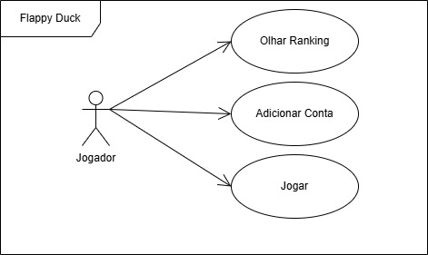

# Flappy Duck – Trio 1

## Integrantes

| Nome | Matrícula | GitHub |
|------|-----------|--------|
| Larissa R. Gabriel | 2024005516 | [@rademakerlarissa-web](https://github.com/rademakerlarissa-web) |
| Matheus Rodrigues Silva | 2024003816 | [@mathk4](https://github.com/mathk4) |
| Yuri Kauã Schwartz Melo | 2024001428 | [@yuri-yksm](https://github.com/yuri-yksm) |
---

## Descrição do projeto

> Nosso projeto tem como intuito criar um jogo divertido a fim de proporcionar entretenimento para os jogadores além de botar em pratica os conhecimentos adquiridos em aula. O jogo se trata em passar com o personagem (Pato) pelo máximo de obstaculos possiveis. Ele consta também com as opções de criar uma conta onde ficará registrada a pontuação em um banco de dados, mostrar Ranking onde exibira a pontuação de todos os jogadores, e "jogar" para iniciar o jogo. 


---

## Tecnologias utilizadas

- JavaScript (ES6+)
- HTML5 / CSS3
- Node.js
- Git / GitHub
- Banco de dados: PostgreSQL
- Framework web: Iremos descobrir 👀
- IDE: Visual Studio Code
- Teste de API: Postman
- Qualidade de Código: ESLint


---

## Como executar o projeto

```bash
# Clone o repositório
git clone https://github.com/wilcilene/prog2-eco-2026-projetos.git

# Acesse a pasta do projeto
cd projetos/Larissa-Matheus-Yuri

# Instale as dependências (se houver)
npm install

# Execute
npm start
```

---

## Estrutura de pastas

```
src/
  ├── index.html        ← ponto de entrada
  ├── css/
  ├── js/
  │   ├── model/          ← classes de domínio
  │   ├── service/        ← regras de negócio
  │   ├── controller/     ← controladores
  │   └── repository/     ← acesso ao banco
  └── db/               ← scripts SQL
```

---

## Histórico de entregas

| Entrega | Descrição | Data | Status |
|---------|-----------|------|--------|
| E1 | Definição do projeto | — | ⏳ |
| E2 | Modelagem | — | ⏳ |
| E3 | Backend + BD | — | ⏳ |
| E4 | Interface integrada | — | ⏳ |
| E5 | Projeto final | — | ⏳ |

> ⏳ Pendente | ✅ Concluído | 🔄 Em andamento
